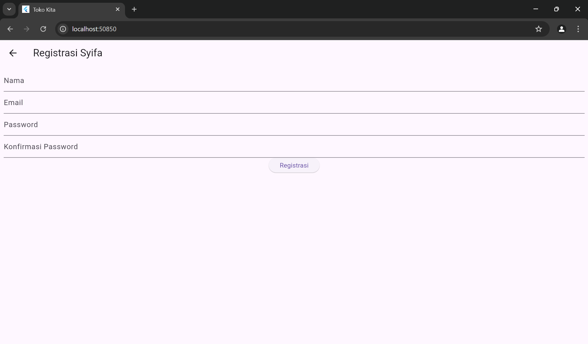

# Tugas 4
## Screen Shoot 




# Tugas 5
## Proses Registrasi
### Registrasi
Tampilan utama yaitu login. Namun, karena belum registrasi, maka harus ke halaman registrasi dengan klik "registrasi

### Input Data
Inputkan data sesuai identitas diri

### Kirimkan Data Registrasi
Setelah proses input, klik registrasi. Jika berhasil maka akan menampilkan teks dialog:

Jika gagal maka akan menampilkan teks dialog: 


### Penjelasan Kode Registrasi 
```
void _submit() {
  _formKey.currentState!.save();
  setState(() {
    _isLoading = true;
  });

  RegistrasiBloc.registrasi(
    nama: _namaTextboxController.text,
    email: _emailTextboxController.text,
    password: _passwordTextboxController.text,
  ).then((value) {
    showDialog(
      context: context,
      barrierDismissible: false,
      builder: (BuildContext context) => SuccessDialog(
        description: "Registrasi berhasil, silahkan login",
        okClick: () {
          Navigator.pop(context);
        },
      ),
    );
  }, onError: (error) {
    showDialog(
      context: context,
      barrierDismissible: false,
      builder: (BuildContext context) => const WarningDialog(
        description: "Registrasi gagal, silahkan coba lagi",
      ),
    );
  });

  setState(() {
    _isLoading = false;
  });
}
```
- Fungsi _submit() dipanggil saat tombol registrasi ditekan.
- _formKey.currentState!.save() menyimpan state form saat ini.
- setState(() { _isLoading = true; }) mengubah state untuk menampilkan indikator loading.
- RegistrasiBloc.registrasi() dipanggil dengan data dari form.
- Kalau registrasi berhasil, dialog pesan sukses dimunculin.
- Kalau registrasi gagal, dialog peringatan dimunculin.
- State loading diubah menjadi false setelah proses selesai.

## Proses Login
Ketika sudah berhasil melakukan registrasi, maka akan diarahkan secara langsung ke halaman login. Lalu inputkan data sesuai dengan data yang telah diregistrasi.

### Login Berhasil
Ketika login berhasil maka diarahkan ke halaman list produk. List Produk berisi informasi nama dan harga produk

### Login Gagal
Jika login gagal, maka akan menampilkan: 

### Penjelasan Kode Login 
```
void _submit() {
  _formKey.currentState!.save();
  setState(() {
    _isLoading = true;
  });
  LoginBloc.login(
    email: _emailTextboxController.text,
    password: _passwordTextboxController.text
  ).then((value) async {
    if (value.code == 200) {
      await UserInfo().setToken(value.token.toString());
      await UserInfo().setUserID(int.parse(value.userID.toString()));
      Navigator.pushReplacement(context,
          MaterialPageRoute(builder: (context) => const ProdukPage()));
    } else {
      showDialog(
        context: context,
        barrierDismissible: false,
        builder: (BuildContext context) => const WarningDialog(
          description: "Login gagal, silahkan coba lagi",
        )
      );
    }
  }, onError: (error) {
    print(error);
    showDialog(
      context: context,
      barrierDismissible: false,
      builder: (BuildContext context) => const WarningDialog(
        description: "Login gagal, silahkan coba lagi",
      )
    );
  });
  setState(() {
    _isLoading = false;
  });
}
```
- Fungsi _submit() dipanggil saat menekan tombol login.
- _formKey.currentState!.save() buat menyimpan state form saat ini.
- setState(() { _isLoading = true; }) buat mengubah state untuk menampilkan indikator loading.
- LoginBloc.login() ini dipanggil dengan email dan password dari controller.
- Kalau loginnya berhasil (kode 200), token dan userID disimpan, lalu navigasi ke halaman produk.
- Kalau loginnya gagal, dialog peringatan dimunculin.
- Lalu yang terakhir, state loading diubah kembali menjadi false baik loginnya berhasil ataupun tidak.

## Detail Produk
Pada halaman ini menampilkan informasi produk dan pilihan ingin mengubah produk tersebut atau menghapus produk tersebut


### Penjelasan Kode Detail Produk
```
class ItemProduk extends StatelessWidget {
  final Produk produk;

  const ItemProduk({Key? key, required this.produk}) : super(key: key);

  @override
  Widget build(BuildContext context) {
    return GestureDetector(
      onTap: () {
        Navigator.push(
          context,
          MaterialPageRoute(
            builder: (context) => ProdukDetail(
              produk: produk,
            )
          )
        );
      },
      child: Card(
        child: ListTile(
          title: Text(produk.namaProduk!),
          subtitle: Text(produk.hargaProduk.toString()),
        ),
      ),
    );
  }
}
```
- ItemProduk adalah widget yang menerima objek Produk sebagai parameter.
- Menggunakan GestureDetector untuk mendeteksi action tekan pada item produk.
- Ketika salah satu item ditekan, navigasi pergi ke halaman ProdukDetail dengan data produk yang dipilih.
- Tampilan menggunakan Card dan ListTile untuk menampilkan nama dan harga produk.

```
class ProdukDetail extends StatefulWidget {
  Produk? produk;

  ProdukDetail({Key? key, this.produk}) : super(key: key);

  @override
  _ProdukDetailState createState() => _ProdukDetailState();
}

class _ProdukDetailState extends State<ProdukDetail> {
  @override
  Widget build(BuildContext context) {
    return Scaffold(
      appBar: AppBar(
        title: const Text('Detail Produk'),
      ),
      body: Center(
        child: Column(
          children: [
            Text(
              "Kode : ${widget.produk!.kodeProduk}",
              style: const TextStyle(fontSize: 20.0),
            ),
            Text(
              "Nama : ${widget.produk!.namaProduk}",
              style: const TextStyle(fontSize: 18.0),
            ),
            Text(
              "Harga : Rp. ${widget.produk!.hargaProduk.toString()}",
              style: const TextStyle(fontSize: 18.0),
            ),
            _tombolHapusEdit()
          ],
        ),
      ),
    );
  }
}
```
- ProdukDetail adalah widget stateful yang menerima objek Produk.
- build method membuat tampilan dengan Scaffold yang memiliki AppBar dengan title "Detail Produk".
- Body Scaffold berisi Column yang menampilkan:
  - Kode produk dengan font size 20.0
  - Nama produk dengan font size 18.0
  - Harga produk dengan font size 18.0 diawali dengan "Rp."
- _tombolHapusEdit() menambahkan tombol untuk mengedit atau menghapus produk.
- Halaman detail mengakses data produk melalui widget.produk dan menampilkannya.
- Data ditampilkan langsung tanpa request jaringan tambahan, karena semua info sudah ada dalam objek Produk yang diteruskan.

## Proses Ubah Produk
Klik produk yang ingin diubah. 
### Inputkan data baru

### Hasil 

### Penjelasan Kode Ubah Produk
```
ubah() {
  setState(() {
    _isLoading = true;
  });
  Produk updateProduk = Produk(id: widget.produk!.id!);
  updateProduk.kodeProduk = _kodeProdukTextboxController.text;
  updateProduk.namaProduk = _namaProdukTextboxController.text;
  updateProduk.hargaProduk = int.parse(_hargaProdukTextboxController.text);
  ProdukBloc.updateProduk(produk: updateProduk).then((value) {
    Navigator.of(context).push(MaterialPageRoute(
        builder: (BuildContext context) => const ProdukPage()));
  }, onError: (error) {
    showDialog(
      context: context,
      builder: (BuildContext context) => const WarningDialog(
        description: "Permintaan ubah data gagal, silahkan coba lagi",
      )
    );
  });
  setState(() {
    _isLoading = false;
  });
}
```
- Fungsi ubah() dipanggil saat menekan tombol ubah.
- State loading diubah menjadi true.
- Objek Produk dibuat dengan ID yang sudah ada dan data baru dari text controller.
- ProdukBloc.updateProduk() akan dipanggil buat memperbarui produk.
- Kalau berhasil, pindah navigasi ke halaman daftar produk.
- Kalau gagal, dialog peringatan dimunculin.
- Terakhir, state loading diubah lagi jadi false.

## Proses Tambah Produk
### Halaman Tambah Produk
untuk menuju ke halaman produk, klik ikon "+" di app bar. Lalu inputkan data.

Setelah menginputkan data, klik tombol "Simpan"
### Hasil 

### Penjelasan Kode Tambah Produk
```
simpan() {
  setState(() {
    _isLoading = true;
  });
  Produk createProduk = Produk(id: null);
  createProduk.kodeProduk = _kodeProdukTextboxController.text;
  createProduk.namaProduk = _namaProdukTextboxController.text;
  createProduk.hargaProduk = int.parse(_hargaProdukTextboxController.text);
  ProdukBloc.addProduk(produk: createProduk).then((value) {
    Navigator.of(context).push(MaterialPageRoute(
        builder: (BuildContext context) => const ProdukPage()));
  }, onError: (error) {
    showDialog(
      context: context,
      builder: (BuildContext context) => const WarningDialog(
        description: "Simpan gagal, silahkan coba lagi",
      )
    );
  });
  setState(() {
    _isLoading = false;
  });
}
```
- Fungsi simpan() dipanggil saat menekan tombol simpan.
- State loading diubah jadi true.
- Objek Produk baru dibuat dengan data dari text controller.
- ProdukBloc.addProduk() akan dipanggil buat nyimpen produk baru.
- Kalau berhasil, pindah ke halaman daftar produk.
- Kalau gagal, dialog peringatan dimunculin.
- Terakhir, state loading diubah lagi menjadi false.

## Proses Hapus Produk
Pilih Produk yang akan dihapus. Lalu akan menampilkan:

Kemudian klik tombol "Ya"
### Hasil 


### Penjelasan Kode Hapus
```
void confirmHapus() {
  AlertDialog alertDialog = AlertDialog(
    content: const Text("Yakin ingin menghapus data ini?"),
    actions: [
      OutlinedButton(
        child: const Text("Ya"),
        onPressed: () {
          ProdukBloc.deleteProduk(id: int.parse(widget.produk!.id!)).then(
            (value) => {
              Navigator.of(context).push(MaterialPageRoute(
                  builder: (context) => const ProdukPage()))
            }, onError: (error) {
            showDialog(
              context: context,
              builder: (BuildContext context) => const WarningDialog(
                description: "Hapus gagal, silahkan coba lagi",
              )
            );
          });
        },
      ),
      OutlinedButton(
        child: const Text("Batal"),
        onPressed: () => Navigator.pop(context),
      )
    ],
  );
  showDialog(builder: (context) => alertDialog, context: context);
}
```
Kode ini buat menghapus produk menampilkan dialog konfirmasi sebelum melakukan penghapusan. Jika dikonfirmasi, ProdukBloc.deleteProduk() akan dipanggil buat  menghapus produk dari database.


## Penjelasan kode Pengambilan Produk
```
FutureBuilder<List>(
  future: ProdukBloc.getProduks(),
  builder: (context, snapshot) {
    if (snapshot.hasError) print(snapshot.error);
    return snapshot.hasData
        ? ListProduk(
            list: snapshot.data,
          )
        : const Center(
            child: CircularProgressIndicator(),
          );
  },
)
```
Kode ini buat melihat produk menggunakan FutureBuilder untuk mengambil dan menampilkan daftar produk.